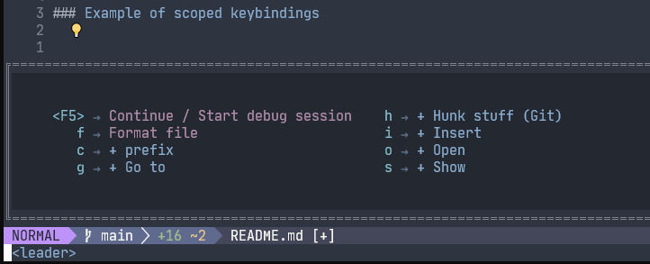
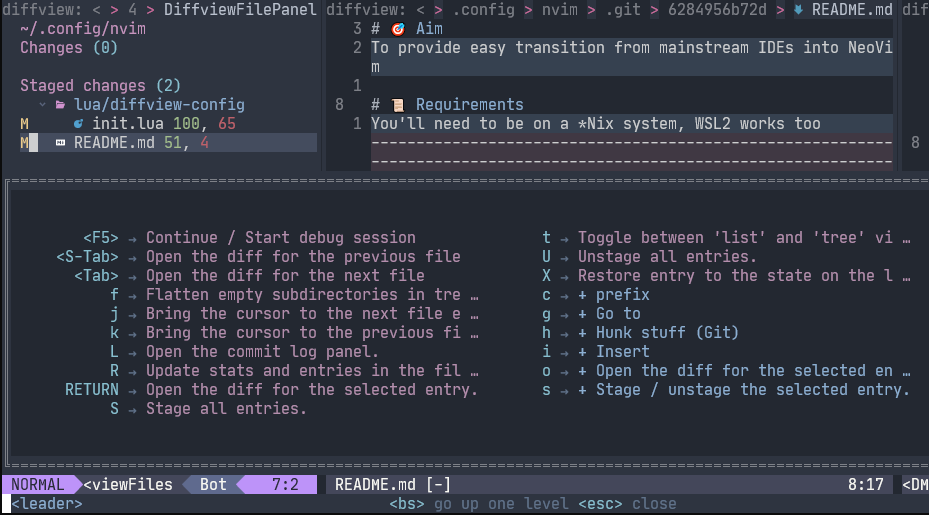

# NoobVim

A nvim config for absolute ~~noobs~~ beginners.

# 🎯 Aim
To provide easy transition from mainstream IDEs into NeoVim.

# 📜 Requirements
You'll need to be on a *Nix system, WSL2 works too.

<details>
  <summary><b><u> Introduction to Vim/Nvim </u></b></summary>

# Glossary of Vim/Nvim Terms

If you've used Vim before, whether as a plugin inside another IDE, or standalone, feel free to skip this section.

When searching for documentation of some feature, you'll probably stumble upon two ways of doing things - either with VimScript, or with Lua. For a bit of context - Vim/Nvim used to be configured with a .vimrc file, which was written entirely in [VimScript](http://vimdoc.sourceforge.net/htmldoc/usr_41.html#script). Luckily for us, Nvim now supports configuration through [Lua](https://lua.org/). 

## Modes

There are 7 modes that your editor can be in, however, the 3 most important ones are: NORMAL, INSERT and VISUAL.
[This article](https://irian.to/blogs/introduction-to-vim-modes/) gives a nice introduction to them. 

## Buffers, Windows and Tabs

Coming into Vim/Nvim, we'll need to let go of the notion that every file is openened in its own tab/window. Windows != Tabs and Windowns != Buffers (needless to say, Buffers != Tabs). 

[This article](https://alpha2phi.medium.com/neovim-for-beginners-managing-buffers-91367668ce7) does a good job of summing up the differences, but a TL;DR version:

- A buffer == file loaded to memory for editing, the file is unchanged until you save it (`:w` in NORMAL mode or `Ctrl+s` in any other mode)
- A window == a way to see a buffer, there might be multiple windows looking at one buffer
- A tab == a collection of windows

## Special key notation
special keys have a short notation in vim, goes as follows:

| Notation         | Key                                                           |
|------------------|---------------------------------------------------------------|
| `<BS>`           | Backspace                                                     |
| `<Tab>`          | Tab                                                           |
| `<C>`            | Control / Command                                             |
| `<A>`            | Alt / Option                                                  |
| `<leader>`       | Up to the user - NoobVim's default is `space`                 |
| `<CR>`           | Enter                                                         |
| `<Enter>`        | Enter                                                         |
| `<Return>`       | Enter                                                         |
| `<Esc>`          | Escape                                                        |
| `<Space>`        | Space                                                         |
| `<Up>`           | Up arrow                                                      |
| `<Down>`         | Down arrow                                                    |
| `<Left>`         | Left arrow                                                    |
| `<Right>`        | Right arrow                                                   |
| `<F1>` - `<F12>` | Function keys 1 to 12                                         |
| `<Insert>`       | Insert                                                        |
| `<Del>`          | Delete                                                        |
| `<Home>`         | Home                                                          |
| `<End>`          | End                                                           |
| `<PageUp>`       | Page-Up                                                       |
| `<PageDown>`     | Page-Down                                                     |
| `<bar>`          | the `\|` character, which otherwise needs to be escaped `\\|` |

## Keybindings (shortcuts)

Each mode has a list of bindings. The bindings are just combinations of keys that'll result in an action. E.g. out of the box, pressing `k` while in NORMAL mode (n) moves the cursor up one line.
There is nothing stopping you from binding the key `k` to do something else.
To see all your bindings currently set up, while in NORMAL mode, type `:map` and press enter. You'll see a lot of lines looking like this:

```text
n  gcc         * <Lua function 76>
                 Comment toggle current line
```
which can be read like this:
| mode prefix | key combination | action                                          |
|-------------|-----------------|-------------------------------------------------|
| n           | gcc             | * <Lua function 76> Comment toggle current line |

or in other words: pressing `gcc` while in NORMAL mode, will result in calling a function that'll invoke the toggle current line functionality of the Comment plugin

### Keybinding scopes

Keybindings have scopes. You can have global keybindings that'll be available for a particular mode in any buffer, or you can scope them to particular buffers.
This is very handy, as you might want to have specific options only in certain scenarios. E.g it'd probably make sense to only have the shortcut to open / go to a file, when you're in a file viewer of sorts, rather than in every buffer.

### Example of scoped keybindings

Globaly scoped keybindings



Locally scoped keybindings - to the 'DiffviewFilePanel' buffer



Notice that the globally scoped keybindings are present in the buffer scoped ones.

### Which-key

NoobVim uses [which-key plugin](https://github.com/folke/which-key.nvim) to keep track of which keybindings are available in any given buffer.

</details>

# 🚀 Getting started
To get up and running, clone this repo to your `~/.config/` and get the following:

## Binaries
- [ripgrep](https://github.com/BurntSushi/ripgrep) for telescope
- [glow](https://github.com/charmbracelet/glow#installation) for glow plugin
- [fd](https://github.com/sharkdp/fd#installation) for telescope-repos
- LSP servers (skip any that you're not interested in):
  - [bash language server](https://github.com/bash-lsp/bash-language-server#installation)
     - [shellcheck](https://github.com/koalaman/shellcheck#installing)
  - [lua-language-server](https://github.com/sumneko/lua-language-server), good docs [here](https://www.chrisatmachine.com/blog/category/neovim/28-neovim-lua-development)
  - [typescript-language-server](https://github.com/typescript-language-server/typescript-language-server#installing) for both JS and TS
  - [marksman](https://github.com/artempyanykh/marksman#how-to-install) for markdown
  - [dockerfile-language-server-nodejs](https://github.com/rcjsuen/dockerfile-language-server-nodejs#installation-instructions) for Dockerfile
  - [terraform-ls](https://github.com/hashicorp/terraform-ls/blob/main/docs/installation.md#installation) for terraform
  - [vscode-json-language-server](https://github.com/neovim/nvim-lspconfig/blob/master/doc/server_configurations.md#jsonls) for JSON

# Using code runner
You can run your project in a single keypress, similar to other popular IDEs. To do so, you'll first need to tell [code_runner](https://github.com/CRAG666/code_runner.nvim#add-projects) how to run your project.

*NB* you'll need to be in the project's directory for this to work as expected.

## ❓ Miscelaneous
- Some of the plugins rely on a Nerd font, [nerd-fonts](https://github.com/ryanoasis/nerd-fonts) will have a nice one. 

once done, source [init.lua](./init.lua) and perform a `:PackerSync` command 

### WSL2 Specific
- With regards to the [font requirement](#Miscelaneous) - the fonts need to be installed on the host machine, and set for WSL2 directly in the properties of the WSL2 app.
- Installing [VcXsrv](https://youtu.be/_MgrjgQqDcE?t=755) is highly recommended - this will allow you to share os clipboard between WSL2 host and the WSL2 instance, so that it can be used in nvim, just note that you'll also need to set up `DISPLAY` env var in your bash/zsh.rc and [pass `-ac` as additional argument to VcXsrv](https://github.com/microsoft/WSL/issues/4106#issuecomment-502345378)
- Accessing your WSL2 instance through the windows [Terminal](https://apps.microsoft.com/store/detail/windows-terminal/9N0DX20HK701) app is recommended, as this terminal emulator supports italics and other styles of text, while having richer support for nerd-fonts

# TODO
- configure luasnip 
- add table of plugins

